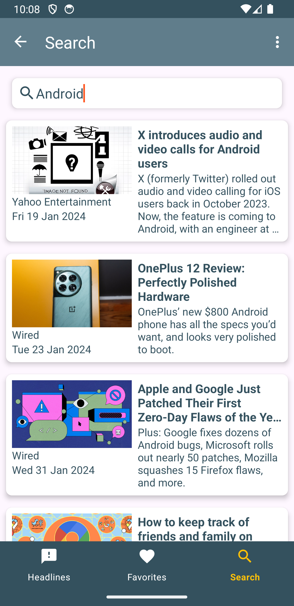

<h1 align="center">NewsHub</h1>

<p align="center">
  <a href="https://opensource.org/licenses/Apache-2.0"></a>
  <a href="https://android-arsenal.com/api?level=21"></a>
  <br>
  <a href="https://wa.me/+5511986726064"></a>
  <a href="https://www.linkedin.com/in/jhonybguerra/"></a>
  <a href="mailto:jhonybguerra@gmail.com"></a>
</p>

<p align="center">  

⭐ Esse é um projeto para demonstrar meu conhecimento técnico no desenvolvimento Android nativo com Kotlin. Mais informações técnicas abaixo.

📰 O NewsHub é um aplicativo de notícias que fornece as manchetes e pesquisas de notícias mais recentes, acessando a API de notícias NewsApi e exibindo artigos em um layout amigável. Os usuários podem salvar artigos favoritos em um banco de dados integrado e ler detalhes completos dos artigos diretamente dentro do aplicativo.

</p>

</br>

<p float="left" align="center">



</p>

## Download
<a href='https://play.google.com/store/apps/details?id=com.jbgcomposer.newshub'></a>

Ou faça o download da <a href="apk/app-debug.apk?raw=true">APK diretamente</a>. Você pode ver <a href="https://www.google.com/search?q=como+instalar+um+apk+no+android">aqui</a> como instalar uma APK no seu aparelho android.

## Tecnologias usadas e bibliotecas de código aberto

- Minimum SDK level: 28
- [Linguagem Kotlin](https://kotlinlang.org/)
- Arquitetura MVVM e Jetpack Lifecycle: Utilização da arquitetura MVVM, integrada com os componentes do Lifecycle do Android Jetpack. 
- Navigation Component: Implementação do componente de Navegação do Jetpack para uma experiência de usuário fluida e uma gestão eficiente dos fragmentos na navegação entre as diferentes telas do aplicativo.
- Retrofit: Consumo eficiente da API de notícias usando Retrofit para chamadas de rede.
- Room Database: Integração com o banco de dados Room para armazenamento persistente de artigos favoritos.
- Paging Library: Implementação da biblioteca de paginação para carregar artigos de forma eficiente e incremental.
- ViewModel: Emprego intensivo do ViewModel para gerenciamento de dados relacionados à UI, garantindo a persistência de dados durante mudanças de configuração e separando as preocupações da lógica de negócios e da interface de usuário.
- LiveData e Kotlin Flow: Uso de LiveData para atualizações de dados reativas e observáveis na interface do usuário. 
- Dagger-Hilt: Injeção de dependência com Hilt para desacoplar a criação de objetos e melhorar a testabilidade.
- Coroutines: Operações assíncronas com Coroutines para chamadas de rede e interações com o banco de dados.
- Glide: Biblioteca para carregamento e caching eficiente de imagens.
- RecyclerView: Exibição de artigos em listas usando RecyclerView para uma experiência de usuário fluida e responsiva.
- Material Design: Interface do usuário construída seguindo as diretrizes do Material Design para uma UX atraente e intuitiva.
- Testes Unitários com JUnit e Mockito: Implementação de testes unitários robustos utilizando JUnit e Mockito para assegurar a confiabilidade do aplicativo.

## Features

### Tela de início apresentando as manchetes mais recentes obtidas através da API, que seleciona notícias com base nas configurações de idioma e localização do dispositivo do usuário.


### Ao selecionar um artigo, ele é aberto dentro de um navegador integrado ao aplicativo, proporcionando uma experiência de navegação contínua. Adicionalmente, há a opção de salvar o artigo em um banco de dados local para consulta futura.


### Realize pesquisas de notícias inserindo termos específicos no campo de busca.


# Licença

```xml
Copyright [2024] [Jhony Bossolane Guerra]

   Licensed under the Apache License, Version 2.0 (the "License");
   you may not use this file except in compliance with the License.
   You may obtain a copy of the License at

     http://www.apache.org/licenses/LICENSE-2.0

   Unless required by applicable law or agreed to in writing, software
   distributed under the License is distributed on an "AS IS" BASIS,
   WITHOUT WARRANTIES OR CONDITIONS OF ANY KIND, either express or implied.
   See the License for the specific language governing permissions and
   limitations under the License.

```
